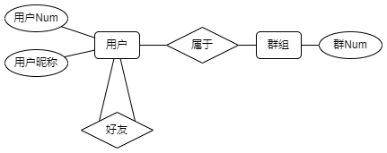

## Protocal & Database

#### 消息格式

`(发送用户;接收用户;类型;消息内容)`

* 使用json组织
* utf-8编码

##### 类型

| 类型号 | 代表消息          |
| ------ | ----------------- |
| 1      | 登录消息          |完成z
| 2      | 服务器响应登录    |完成z
| 3      | 一对一消息        |完成z
| 4      | 群发消息          |完成z
| 5      | 注销消息          |完成z
| 6      | 发送文件开始/结束 |
| 7      | 请求用户ip        |暂无
| 8      | 好友上线提醒      |完成z
| 9      | 好友请求          |
| 10     | 好友回应          |
| 11     | 个人信息修改      |
| 12     | 发送图片开始/结束 |
| 13     | 注册请求         |完成z
| 14     | 响应注册         |完成z
| 15     | 个人信息修改回应  |

##### 用户

* 每个用户拥有一个号码（类似QQ号，'U' + 数字串）
* 每个群拥有一个群号（'G' + 数字串）

* 用户Num=用户id

#### 登录过程

```
Client-->Server
(发送用户(用户Num);接受用户();类型(1);消息内容(用户IP,密码))
Server-->Client
(发送用户();接受用户(用户Num);类型(2);消息内容(用户拥有的好友与群聊))
// 群聊信息包括群号，群成员的信息，群成员是否在线
Server-->Client
(发送用户();接受用户(用户Num);类型(8);消息内容(上线用户Num))
```


#### 注销过程

```
关闭程序时进行
Client-->Server
(发送用户(用户Num);接受用户();类型(5);消息内容(注销))
```


#### 聊天过程

##### 一对一聊天

```
Client-->Server
(发送用户(用户Num);接受用户(用户Num);类型(3);消息内容(聊天消息))
Server-->Client
(发送用户(用户Num);接受用户(用户Num);类型(3);消息内容(聊天消息))
```

##### 群聊

```
Client-->Server
(发送用户(用户Num);接受用户(群Num);类型(4);消息内容(聊天消息))
Server-->Client
(发送用户(群Num);接受用户(用户Num);类型(4);消息内容(聊天消息))
```


#### 发送文件

```
Client-->Server
(发送用户(用户Num);接受用户();类型(7);消息内容(目标用户Num))
Server-->Client
(发送用户();接受用户(用户Num);类型(7);消息内容(目标用户ip))

(new port)
Client-->Client
(发送用户(用户Num);接受用户(用户Num);类型(6);消息内容(开始发送))
file_name|file_size
文件传输(每次发送固定大小)
(发送用户(用户Num);接受用户(用户Num);类型(6);消息内容(发送结束))
```


#### 加好友

```
Client-->Server
(发送用户(用户Num);接受用户();类型(9);消息内容(目标用户Num))
Server-->Client
(发送用户();接受用户(用户Num);类型(9);消息内容(好友请求from请求用户Num))

回应过程
Client-->Server
(发送用户(用户Num);接受用户();类型(10);消息内容(通过/不通过))
Server-->Client
(发送用户();接受用户(用户Num);类型(10);消息内容(通过/不通过))
```


#### 修改个人信息

```
Client-->Server
(发送用户(用户Num);接受用户();类型(11);消息内容(修改过后的用户信息))
Server-->Client
(发送用户();接受用户(用户Num);类型(11);消息内容(更新用户信息内容))
```


#### 发送图片

```
(new port)
Client-->Server
(发送用户(用户Num);接受用户();类型(12);消息内容(开始发送))
file_name|file_size
文件传输(每次发送固定大小)
(发送用户(用户Num);接受用户();类型(12);消息内容(发送结束))

Server-->Client
(发送用户();接受用户(用户Num);类型(12);消息内容(开始发送))
file_name|file_size
文件传输(每次发送固定大小)
(发送用户();接受用户(用户Num);类型(12);消息内容(发送结束))
```


##### 发送表情实现方法

使用代码表示表情，如`/xyx`


### 数据库

##### E-R图



User

| 属性         | 类型    | 主键 | 外键 |
| ------------ | ------- | ---- | ---- |
| 用户Num      | VARCHAR | √    | √    |
| 用户昵称     | VARCHAR |      |      |
| 用户ip地址   | VARCHAR |      |      |
| 是否在线     | bool    |      |      |
| 其他扩展信息 |         |      |      |

Group

| 属性  | 类型    | 主键 | 外键 |
| ----- | ------- | ---- | ---- |
| 群Num | VARCHAR | √    | √    |

User_Friends

| 属性     | 类型    | 主键 | 外键 |
| -------- | ------- | ---- | ---- |
| 用户1Num | VARCHAR | √    | √    |
| 用户2Num | VARCHAR | √    | √    |

User_Group

| 属性    | 类型    | 主键 | 外键 |
| ------- | ------- | ---- | ---- |
| 群Num   | VARCHAR | √    | √    |
| 用户Num | VARCHAR | √    | √    |